# How to Sign Up for OKX Exchange: Complete Guide to Deposits, Withdrawals, and Maximum Fee Discounts

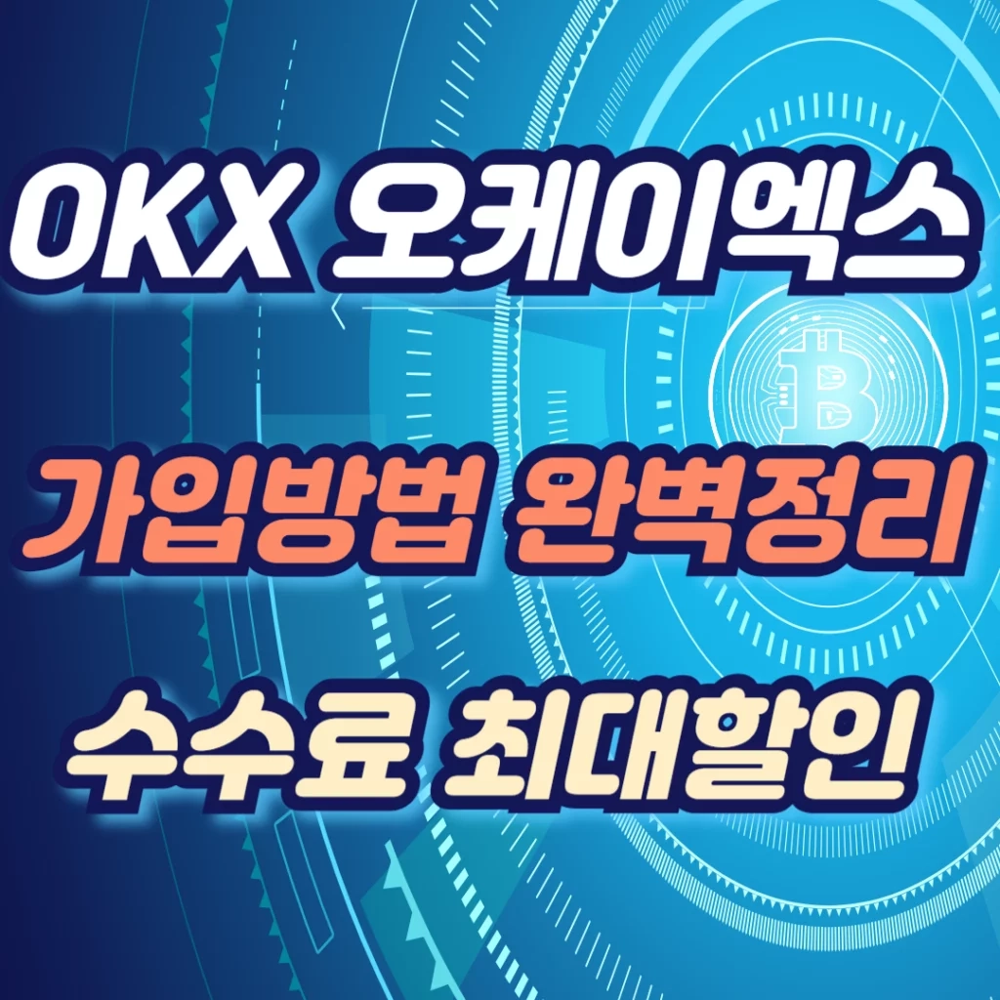

Looking to trade crypto on a reliable platform? With Bitcoin breaking the $100,000 mark, more traders are turning to overseas exchanges for futures trading opportunities. OKX stands out as one of the most trusted cryptocurrency exchanges globally, offering seamless integration with major Korean exchanges like Bithumb and Upbit for easy deposits and withdrawals. This guide walks you through everything from account creation to your first transaction.

---

## What Makes OKX Exchange Stand Out

OKX ranks as one of the world's leading cryptocurrency exchanges, consistently placing in the top 3 on CoinMarketCap by trading volume and user base.

The platform's popularity among Korean traders comes from its comprehensive feature set and user-friendly interface. Whether you're interested in spot trading, futures, or options, OKX provides multiple investment pathways that work for both beginners and seasoned traders.

What really sets OKX apart is its Travel Rule integration with major Korean exchanges like Bithumb and Upbit. This means you can move funds in and out whenever you need to, without bureaucratic hassles or unnecessary delays.

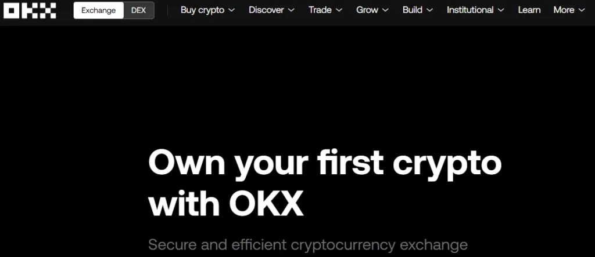

---

## Creating Your OKX Account

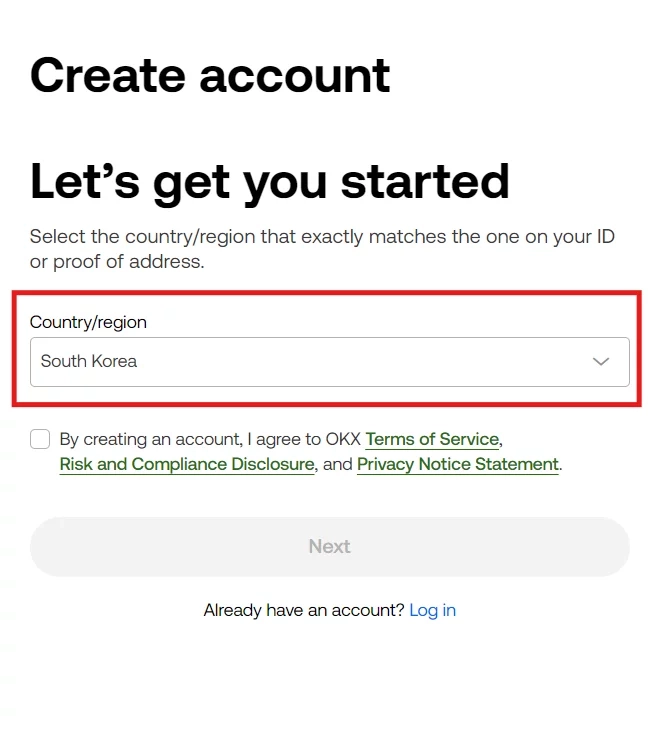

Getting started on OKX is straightforward. Head to the official OKX website and click the "Sign Up" button. Select 'South Korea' as your country, check the agreement box, and hit 'Next'.

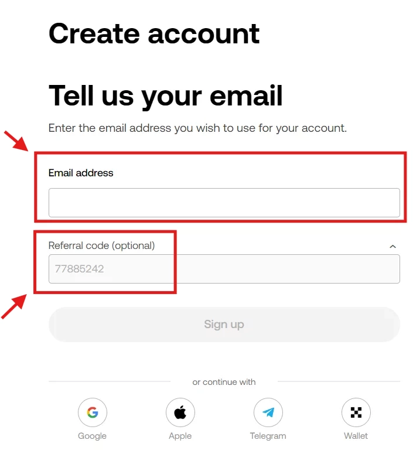

You'll need to provide an email address and create a secure password. After that, verify your phone number to complete the basic registration. Here's where it gets interesting—when you use referral code **47044926** during signup, you unlock discounted trading fees that can save you money on every transaction.

👉 [Join OKX with maximum fee discounts and start trading smarter](https://www.okx.com/join/47044926)

Once you're in, you'll have access to all of OKX's features. The platform's third-place ranking on CoinMarketCap reflects its solid reputation and high liquidity, so you can trade with confidence.

---

## Completing KYC Verification

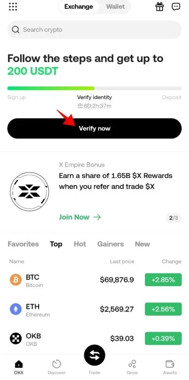

KYC (Know Your Customer) verification is your gateway to full platform access. Download the OKX app, log in, and tap the "Verify now" button on the main screen.

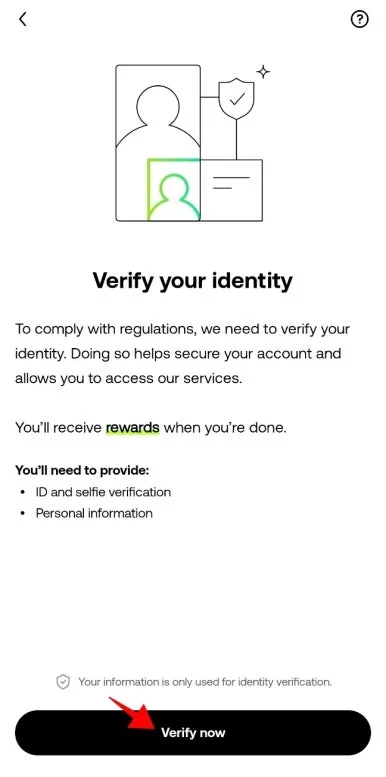

You'll be asked to choose your ID type—driver's license, passport, or national ID card. The app provides clear photo guidelines, so follow them closely. Make sure your document is fully visible, well-lit, and free from glare or blur.

Snap photos of the front and back of your ID, then take a selfie. That's it. Once OKX processes your verification, you're cleared to use all trading features and withdrawal functions. The whole thing usually takes just a few minutes.

---

## How to Deposit Funds

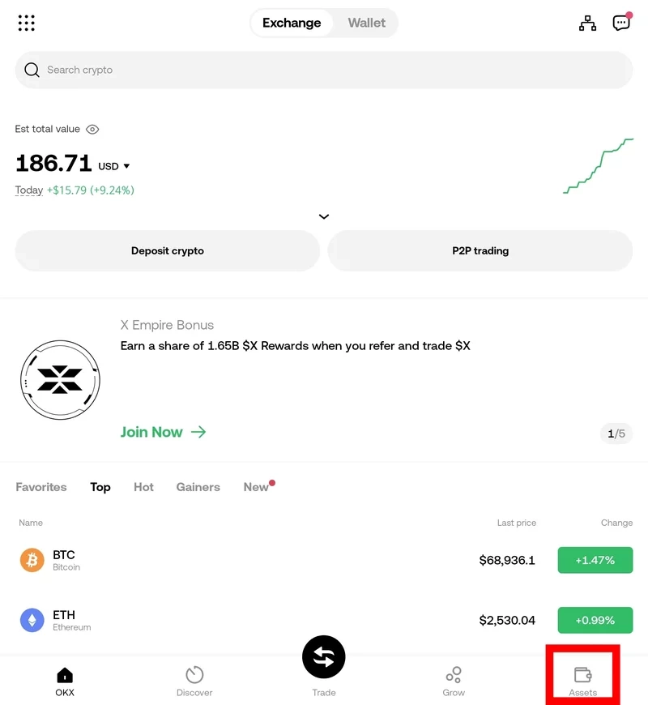

Moving crypto into OKX is simple. Open the app, tap "Assets," then select "Deposit."

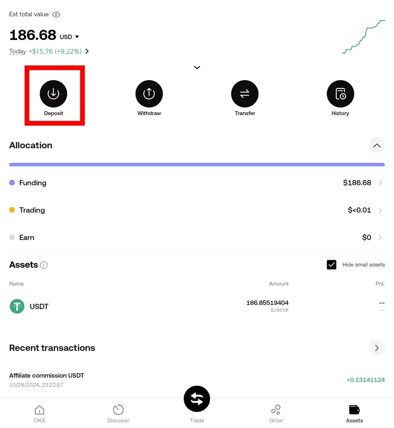

You'll see two options—choose "Deposit crypto." Type the name of the coin you want to deposit in the search bar. Let's say you're depositing XRP. After selecting it, you'll need to pick the network (Ripple for XRP).

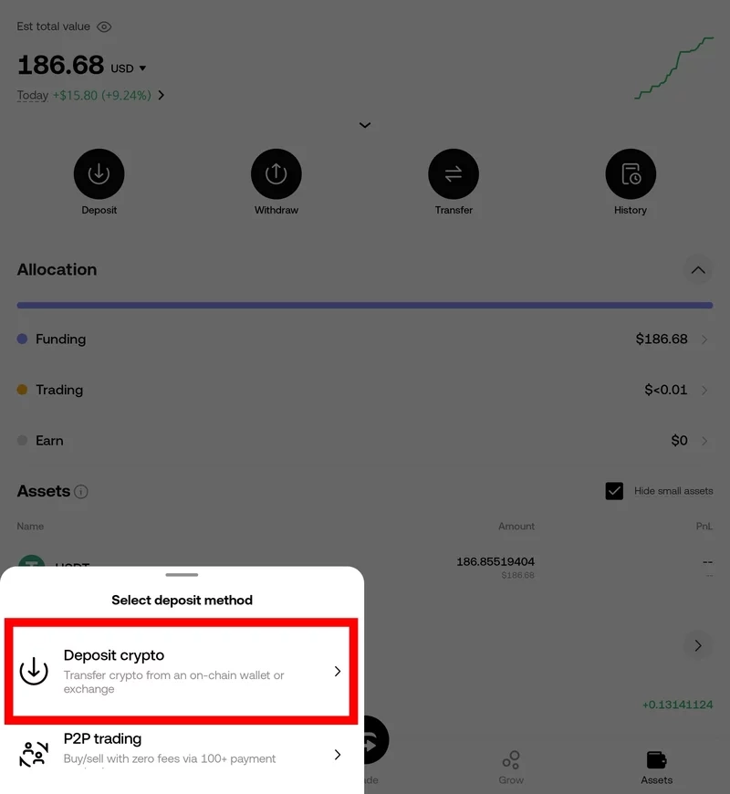

The app generates a deposit address and tag, displayed as both a QR code and text string. Copy this information and paste it into your sending exchange's withdrawal form. Double-check everything before confirming—wrong addresses mean lost funds. Once you hit send, your deposit typically arrives within minutes, and you're ready to trade.

---

## Withdrawing from OKX

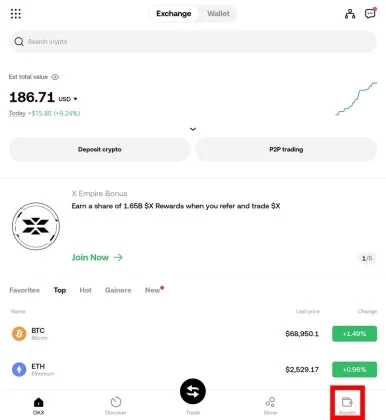

Withdrawals follow a similar pattern. From the main screen, tap "Assets," then "Withdraw."

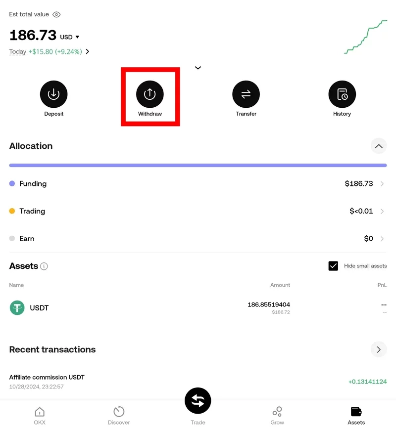

Pick the cryptocurrency you want to send out. If you're withdrawing USDT, for example, click "Address book" and select the Tron network (or whichever network your receiving wallet uses).

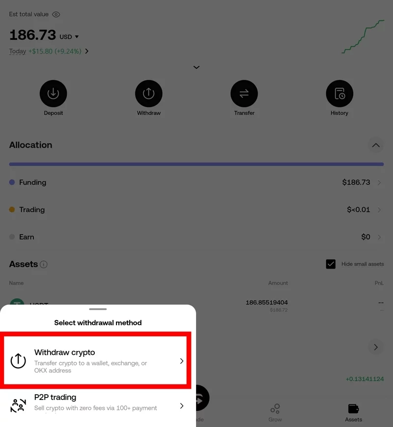

Enter the destination address carefully—no typos allowed here. Input the amount you want to withdraw, review the details, and confirm. Since the process mirrors deposits, you'll get comfortable with it quickly. After confirmation, your funds typically reach their destination within minutes to an hour, depending on network congestion.

---

## Why Choose OKX Exchange

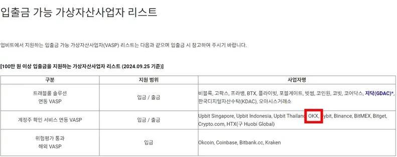

OKX earns its reputation through several key advantages. High trading volumes mean better liquidity and tighter spreads. The platform supports hundreds of cryptocurrencies, giving you plenty of options beyond Bitcoin and Ethereum.

The seamless connection with Korean exchanges removes a major friction point. You can move funds to and from Bithumb or Upbit without jumping through hoops, making OKX practical for Korean traders who want international market access.

Beyond basic spot trading, OKX offers futures contracts, options, and even staking opportunities. This range means you can start simple and explore more sophisticated strategies as you learn. Whether you're just starting out or you've been trading for years, OKX adapts to your skill level.

---

## Final Thoughts

We've covered everything you need to get started on OKX—from creating your account and completing KYC verification to making your first deposit and withdrawal.

The cryptocurrency market moves fast, but OKX makes it approachable with its intuitive design and robust features. After signing up and verifying your identity, you can start trading quickly and securely. The deposit and withdrawal process becomes second nature after your first transaction.

Ready to dive in? Set up your account today and remember to join communities where traders share insights and strategies. Trade smart, stay informed, and always manage your risk carefully. 👉 [Get started on OKX with exclusive fee discounts—your gateway to global crypto markets](https://www.okx.com/join/47044926)
